# **TERRAFORM MODULE CI POC**

| **Author** | **Created on** | **Version** | **Last updated by** | **Last Edited On** | **Level** | **Reviewer** |
|------------|--------------|-------------|----------------|---------------|-------------|-------------|
| Mohit Kumar | 03-2025 | Version 1 | Mohit Kumar | 02-2025 | Internal Reviewer | |

## Table of Contents
1. [Introduction](#introduction)  
2. [Why Terraform Module CI?](#why-terraform-module-ci)  
3. [Terraform CI Steps](#terraform-ci-steps)  
4. [CI/CD Workflow](#cicd-workflow)  
5. [Contact Information](#contact-information)  
6. [References](#references)  

---
## Introduction
Terraform Module CI (Continuous Integration) ensures the quality, consistency, and security of infrastructure code. It automates testing and validation, reducing human errors and making infrastructure management more efficient.

## Why Terraform Module CI?
✅ Automates infrastructure validation and testing.  
✅ Ensures code consistency and best practices.  
✅ Reduces risks of misconfiguration.  
✅ Provides cost estimation before applying changes.  
✅ Enhances collaboration in infrastructure development.  

## Terraform CI Steps

| **Step**              | **Description** |
|----------------------|------------------------------------------------------------------|
| **🧹 Clean**           | Removes any existing Terraform state or cache files to start with a clean slate. |
| **📂 Clone**           | Fetches the latest version of the Terraform module from the repository. |
| **⚙️ Init**            | Initializes the Terraform working directory, downloading necessary provider plugins and modules. |
| **📝 Fmt**             | Formats Terraform code to maintain consistency and readability. |
| **✅ Validate**        | Checks the syntax and structure of Terraform configuration files to catch errors before applying them. |
| **🔍 Lint**            | Runs static analysis tools to detect potential issues in the Terraform code. |
| **🔒 Checkov**         | Performs additional verification steps such as compliance and security checks. |
| **💰 Cost Estimation** | Calculates the cost impact of proposed infrastructure changes before applying them. |

---
## CI/CD Workflow

```mermaid
flowchart LR
    A[🔗 SCM - e.g., Git] --> B[🛠 Jenkins Server]
    B --> C{🚀 Pipeline Job}
    C --> D[📜 Jenkinsfile]
    D --> E[📦 Library: your-shared-library-name]
    E --> F[📂 Shared Library]
    F --> G{📁 src Directory}
    G --> H{📁 ci Directory}
    H --> I{📁 terraform Directory}
    I --> J{📁 common} & K{📁 template} & L{📁 terraformCI}
    J --> M[📜 gitclone.groovy] & N[📜 wsclean.groovy]
    K --> O[📜 template.groovy]
    L --> P[🔒 checkov.groovy] & Q[💰 cost.groovy] & R[📝 fmt.groovy] & S[⚙️ init.groovy] & T[🔍 lint.groovy] & U[✅ validate.groovy]
```

### Workflow Explanation

🔗 **[1. Source Code Management (SCM)](#ci-cd-workflow)**  
Your codebase, including the Jenkinsfile and the Terraform modules, is stored in a version control system like GitHub, GitLab, or Bitbucket.

🚀 **[2. Pipeline Job Execution](#ci-cd-workflow)**  
The pipeline job starts executing the stages defined in the Jenkinsfile. The Jenkinsfile uses the shared library to call reusable Groovy functions.

# First we configuredi ti n Shared library section to use it in pipeline 

# Here we have configred it calkling piplone fro mscript form scm

Below is the Jnekinsfile whihch is being called

Output of the Execution

📦 **[3. Shared Library Structure](#ci-cd-workflow)**  
The shared library organizes reusable scripts into logical categories:
- **common/**: General-purpose scripts like `gitclone.groovy`, `wsclean.groovy`.
- **template/**: Boilerplate scripts like `check.groovy`.
- **terraformCI/**: Terraform-specific CI scripts like `checkov.groovy`, `fmt.groovy`, `validate.groovy`, etc.

  

📝 **[4. Terraform Module Execution](#ci-cd-workflow)**  
The pipeline executes CI tasks on your Terraform module:
1. Clone the repository (`gitclone.groovy`).
2. Initialize Terraform (`init.groovy`).
3. Format code (`fmt.groovy`) to ensure consistency.
4. Validate configurations (`validate.groovy`).
5. Run linting (`lint.groovy`) to check for syntax issues.
6. Perform security checks (`checkov.groovy`).
7. Analyze costs (`cost.groovy`).

📊 **[5. Report Generation](#ci-cd-workflow)**  
- **TFLint Report**: Below, you can find an image showing the TFLint report.
- **Checkov Report**: Below, you can find an image showing the Checkov security report.
- **Infrastructure Cost Report**: Below, you can find an image showing the Infra cost analysis report.

🔄 **[6. Continuous Integration Workflow](#ci-cd-workflow)**  
Jenkins orchestrates the entire CI process:
- Pulls code from SCM.
- Loads and executes shared library functions.
- Runs tests and validations on Terraform modules.
- The workflow follows an iterative cycle of: **Code → Test → Feedback**.

✅ **Benefits of This Workflow**  
✔️ **Modularity:** The shared library organizes reusable scripts into logical categories, making it easy to maintain.  
✔️ **Reusability:** Functions can be reused across multiple pipelines, reducing duplication.  
✔️ **Automation:** Jenkins automates repetitive tasks like linting, validation, and testing.  
✔️ **Scalability:** New CI tasks can be added easily by creating additional Groovy scripts.  

---
## Contact Information

| **Name** | **Email address** |
|----------|-------------------------------|
| Mohit Kumar | [📧 mohit.kumar@mygurukulam.co](mailto:mohit.kumar@mygurukulam.co) |

---
## References

| 🌐 Link | 📖 Description |
|---------------------------------------------------------------------------------------------------------------|-----------------------------------------------------------|
| [TFLint Documentation](https://github.com/terraform-linters/tflint) | Terraform Linter documentation. |
| [Infracost Documentation](https://www.infracost.io/docs/) | Infracost documentation for cost estimation. |
| [Terraform CI Documentation](https://developer.hashicorp.com/terraform/tutorials/automation) | HashiCorp Terraform CI/CD guide. |

