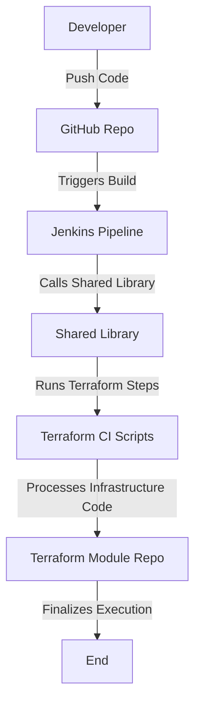

# Terraform CI Pipeline

## Table of Contents
1. [Introduction](#introduction)
2. [Why Terraform CI?](#why-terraform-ci)
3. [CI Pipeline Steps](#ci-pipeline-steps)
   - [Clean](#clean)
   - [Clone](#clone)
   - [Init](#init)
   - [Fmt](#fmt)
   - [Validate](#validate)
   - [Lint](#lint)
   - [Check](#check)
   - [Cost Estimation](#cost-estimation)
4. [Project Structure](#project-structure)
5. [Jenkins Pipeline Flow](#jenkins-pipeline-flow)
6. [GitHub and Shared Library Integration](#github-and-shared-library-integration)
7. [Mermaid.js Diagram](#mermaidjs-diagram)
8. [Visual Representation](#visual-representation)

## Introduction
This document describes the Continuous Integration (CI) pipeline for Terraform using Jenkins and a shared library. The pipeline automates the validation, formatting, linting, and cost estimation of Terraform code before deployment.

## Why Terraform CI?
Terraform CI ensures that infrastructure as code (IaC) changes are:
- Properly formatted
- Validated for errors
- Checked for best practices using linting
- Estimated for cost implications before applying changes
- Automated via a Jenkins pipeline using a shared library

## CI Pipeline Steps

### Clean
- Removes any previous state or temporary files.
- Ensures a fresh start for the pipeline execution.

### Clone
- Pulls the latest code from the repository.
- Uses a shared library function for cloning.

### Init
- Runs `terraform init` to initialize Terraform modules and providers.

### Fmt
- Runs `terraform fmt` to ensure consistent code formatting.

### Validate
- Runs `terraform validate` to check the configuration syntax.

### Lint
- Uses `tflint` to perform static code analysis and detect potential issues.

### Check
- Ensures all dependencies are met and verifies resource configurations.

### Cost Estimation
- Uses `terraform cost estimation` (e.g., Infracost) to predict infrastructure costs before applying changes.

## Project Structure
```
terraform-ci-pipeline/
├── src/
│   ├── common/
│   │   ├── clean.sh
│   │   ├── clone.sh
│   ├── terraform-ci/
│   │   ├── init.sh
│   │   ├── fmt.sh
│   │   ├── validate.sh
│   │   ├── lint.sh
│   │   ├── check.sh
│   │   ├── cost.sh
│   ├── templates/
│   │   ├── pipeline-template.sh
│   ├── Jenkinsfile
```

## Jenkins Pipeline Flow
- The `Jenkinsfile` calls a shared library to execute the Terraform CI steps.
- Each step is implemented as a separate script in `terraform-ci/`.
- The template file organizes the execution order.
- The pipeline automatically runs the Terraform CI process on every push or pull request in GitHub.

## GitHub and Shared Library Integration
- The shared library contains reusable scripts for Terraform CI.
- The Terraform module is stored in a separate repository or directory.
- The pipeline template file sources the necessary scripts dynamically.
- The Jenkinsfile imports the shared library and calls the Terraform CI steps.

## Mermaid.js Diagram


## Visual Representation
### GitHub & Jenkins Flow


This diagram represents the flow from a developer pushing code to GitHub, triggering a Jenkins pipeline, which then calls a shared library and runs Terraform CI steps before executing the Terraform module.

---
This README provides a clear understanding of the Terraform CI pipeline, its integration with GitHub, Jenkins, and shared libraries, along with detailed diagrams for better visualization.

